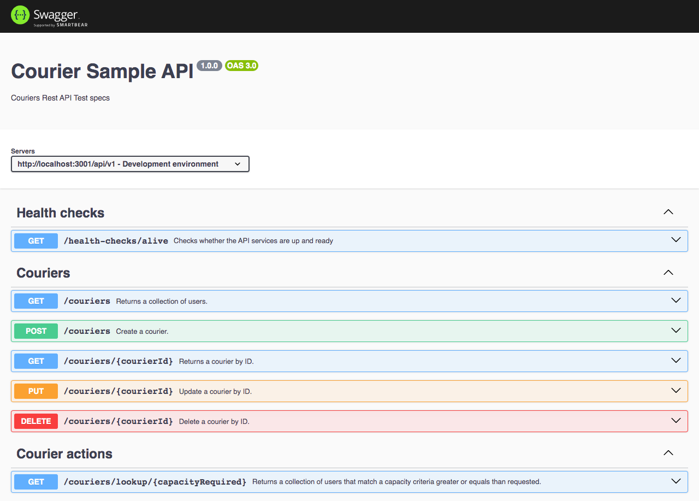

# Assestment considerations
// TBD

# How to run the project
// TBD

# API Endpoints

#### API Docs

Swagger API Docs

````javascript
URI: /docs
````



#### Health checks
###### Example cURL

```javascript
$ curl --location 'http://localhost:3001/api/v1/health-checks/alive'
```

#### Couriers

Basic CRUD operations

````javascript
URI: /couriers
````

##### Get all couriers
###### Example cURL
```javascript
$ curl --location 'http://localhost:3001/api/v1/couriers'
```

##### Get courier by ID
###### Example cURL
```javascript
$ curl --location 'http://localhost:3001/api/v1/couriers/65b93d111efb464a86c6d109'
```

##### Create courier
###### Example cURL
```javascript
$ curl --location 'http://localhost:3001/api/v1/couriers' \
--header 'Content-Type: application/json' \
--data '{
    "max_capacity": 100
}'
```

##### Update courier by ID
###### Example cURL
```javascript
$ curl --location --request PUT 'http://localhost:3001/api/v1/couriers/65b93d4e1afd3c4aab06a8d5' \
--header 'Content-Type: application/json' \
--data '{
    "max_capacity": 50
}'
```

##### Delete courier by ID
###### Example cURL
```javascript
$ curl --location --request DELETE 'http://localhost:3001/api/v1/couriers/65b93d92d1f6ff4ad25961c6'
```

#### Courier actions

````javascript
URI: /couriers/lookup/:capacity_required
````

##### Lookup
Request data from this API to find out which couriers do have available space. (Greater or equals than the requested capacity)
###### Example cURL
```javascript
$ curl --location 'http://localhost:3001/api/v1/couriers/lookup/700'
```
